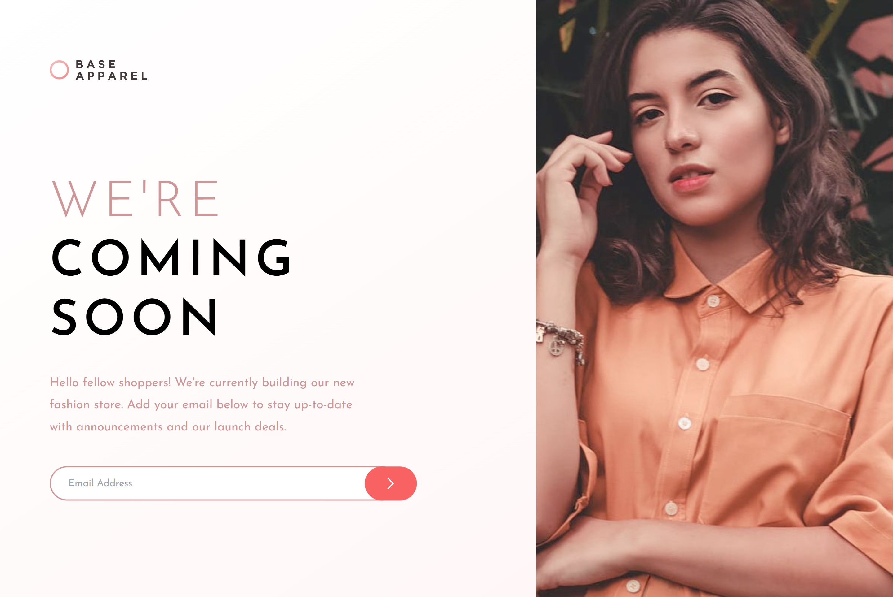
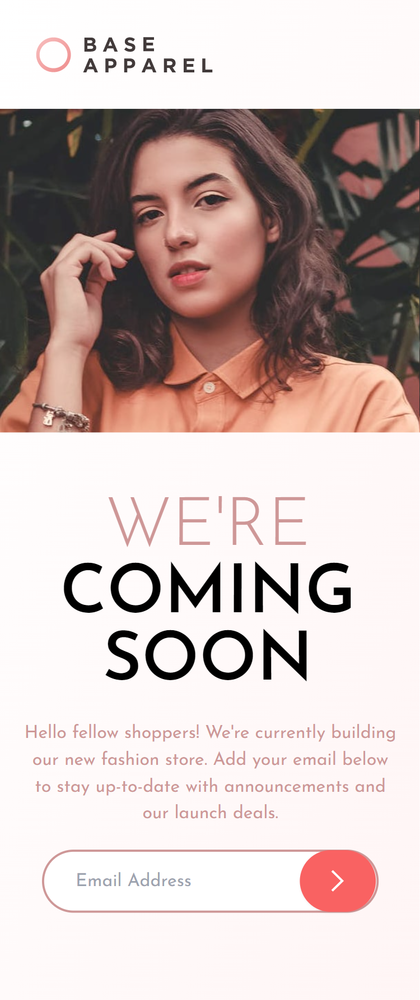

# Frontend Mentor - Base Apparel coming soon page solution

This is a solution to the [Base Apparel coming soon page challenge on Frontend Mentor](https://www.frontendmentor.io/challenges/base-apparel-coming-soon-page-5d46b47f8db8a7063f9331a0). Frontend Mentor challenges help you improve your coding skills by building realistic projects. 

## Table of contents

## Overview

### Screenshot

Desktop View

Mobile View

### Links

- Solution URL: [Solution](https://www.frontendmentor.io/solutions/faq-accordion-card-ZRNKpuudS)
- Live Site URL: [Live Site](https://github.com/sansarj17/FM-BaseApparel-TW)

### Built with

- Tailwind CSS
- CSS Grid
- CSS Flexbox
- CSS custom properties

## Author

- Github - [@sansarj17](https://github.com/sansarj17/)
- Frontend Mentor - [@sansarj17](https://www.frontendmentor.io/profile/sansarj17)